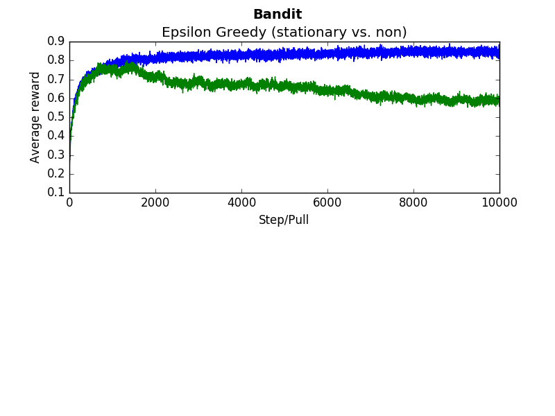
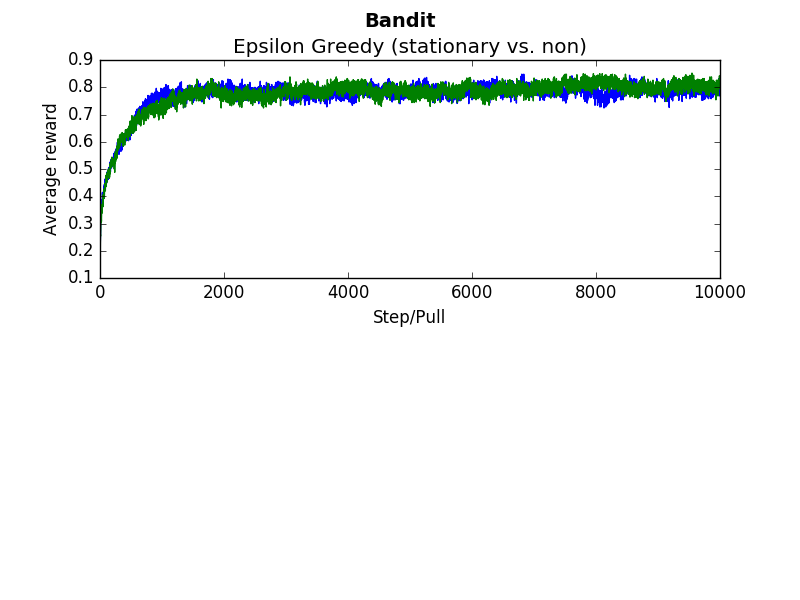
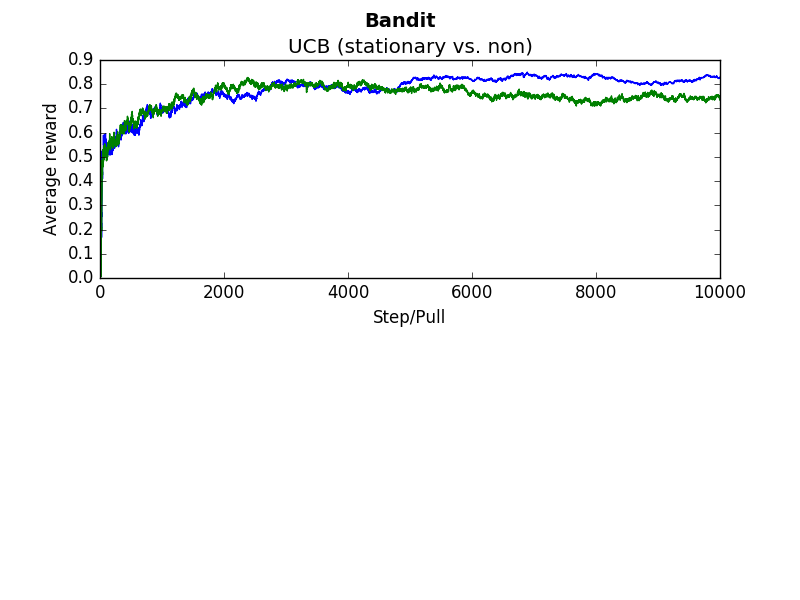
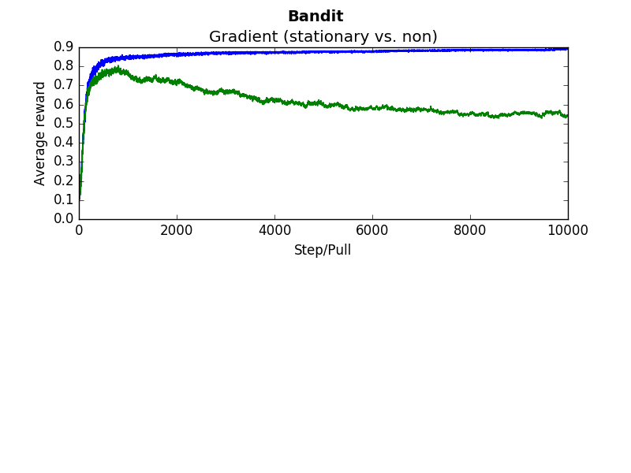

#Reinforcement learning for Non-Stationary bandits

##Problem Description
Imagine a slot machine with multiple arms that can be pulled. However, unlike most slot machine, this machine actually has a "best" arm to pull. If the reward you received from each arm was deterministic, determining which arm to pull would be simple. Just pull each 10, and then start picking the max. But these arms return stochastic values from a mean with variance. So the task of determining which arm to pull requires sampling from several different arms. In addition, if your goal is to maximize the reward at the casino, you don't want to simply explore to determine the best arm. You also want to exploit your existing knowledge in an attempt to maximize rewards. One final wrinkle is that the mean of these arms may change over time. This is considered "non-stationary." Given this type of environment, exploration is constantly needed.

##Solution
We will use Reinforcement learning - using several different bandit algorithms. These algorithms attempt to balance exploration and exploitation in different ways. Each algorithm can be tweaked appropriately by changing some parameter. The code included in this project allows us to experiment with different algorithms and parameters. 

##Usage
There are several important files main files:

1. [TestHarness.py](TestHarness.py)
  * This contains several functions making it easy to test various different algorithms.
2. [Arm.py](Arm.py)
  * Represents one arm within a bandit. 
  * Each arm has a mean and variance from which rewards are stochastically returned
3.  [Bandit.py](Bandit.py)
  * Contains several arms, each of which can be "pulled" to receive a reward.

There are two basic ways to test various algorithms, both from within TestHarness.py
Testing each algorithm can be done in a similar fashion as:

```python
from TestHarness import *
"""
It is important to average rewards across several different runs since bandits 
are created randomly. Therefore the results could be incredibly skewed (for 
better or worse) depending on what type of bandit was created. ie. if one arm 
is significantly better than all others, all algorithms will perform well. 
"""
#Plot the average reward at each pull, averaged over 1000 different runs
testUCB(runs = 1000, pulls = 20000, stationary = False, c=2, alpha=0.1)

#Same as above, but for a stationary bandit and using a gradient method
testGradient(runs=1000, pulls=20000, stationary=True, alpha=0.1):

```

It is one thing to test algorithms independently, but you can also test different algorithms and parameter values at the same time using the same bandit. This is important since, if you're comparing algorithms against each other, you want each to have an equal chance against each other. To do so, you can manipulate def testAllAlgorithms() method such that it instantiates the algorithms that you want tested. 


##Results
The following are several results obtained when comparing algorithms against stationary and non stationary bandits. As you can tell, some algorithms continue to perform well (epsilon greedy with a constant step size, UCB). While others (epsilon greedy with average returns, optimistic greedy, and gradient start to perform more poorly as the bandit randomly walks. 

Each graph below was taken as the average over 500 runs of 10,000 steps. Where not explicitly noted, an alpha and epsilon of 0.1 were used.

Blue lines indicate the stationary bandit while green indicates the non-stationary version.

Epsilon Greedy with using a average return. 




Epsilon Greedy with a constant step size of 0.1



Upper confidence bound with c = 2 



Gradient method  



##Further Study
